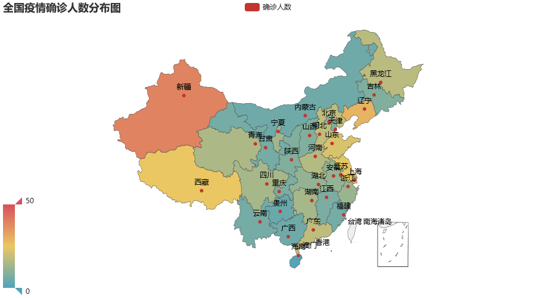
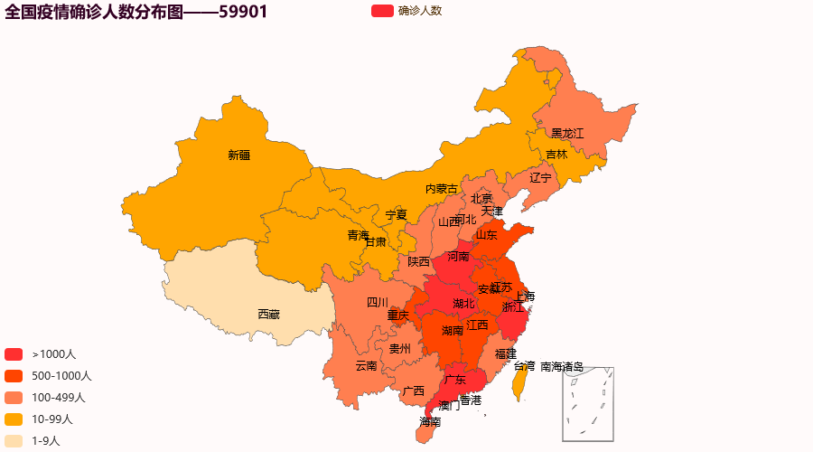

## 本文主要内容

- 目前困境
- 使用说明
- 使用pyecharts搭建中国疫情地图
- 肺炎实时追踪页面制作
- 后续开发
- 参考资料

## 困难

- 数据来源问题已经解决，原本是根据支付宝的肺炎实时追踪手敲的，并保存在data_2020_02_12.py中。现在使用腾讯数据接口获取疫情数据。
- 省份确诊人数在市级上不产生颜色和数字变化

## 使用说明

### 文件作用说明

- readme.md即本说明文档
- images文件夹存放的是相关图片
- data_2020_02_12.py是根据支付宝手敲的数据，可以不看
- getData.py是利用腾讯数据接口获取疫情数据
- 中国疫情地图.py用于生成中国疫情地图.html文件
- 中国疫情地图.html用于在浏览器上展示，双击或拖拽到浏览器即可
- 肺炎实时追踪.html/.css将汇总各个页面，预计展示以下信息：
  - 全国疫情确诊人数分布图
  - 省份疫情确诊人数分布图
  - 全球疫情确诊人数分布图
  - 累计趋势分析
  - 增长趋势分析
  - 国内疫情数据汇总
  - 国外疫情数据汇总
  - 疫情实时讯息

## pyecharts

### pyecharts的介绍

pyecharts是一个用于生成Echarts图表的类库，Echarts是百度开源的一个数据可视化JS库

### pyecharts的安装

- 安装库：pip install pyecharts
- 安装地图文件：
  - 全球国家地图: pip install echarts-countries-pypkg
  - 中国省级地图: pip install echarts-china-provinces-pypkg
  - 中国市级地图: pip install echarts-china-cities-pypkg
  - 中国区县级地图: pip3 install echarts-china-counties-pypkg 
  - 中国区域地图: pip3 install echarts-china-misc-pypkg

### pyecharts的使用

- [pyecharts官网](http://pyecharts.org/#/)
- [pyecharts效果图展示](http://pyecharts.herokuapp.com/)

### pyecharts的代码示例

``` python
from pyecharts.charts import Map
from pyecharts import options as opts
#将数据处理成列表
locate = ['北京','天津','河北','山西','内蒙古','辽宁','吉林','黑龙江','上海','江苏','浙江','安徽','福建','江西','山东','河南','湖北','湖南','广东','广西','海南','重庆','四川','贵州','云南','陕西','甘肃','青海','宁夏','新疆','西藏']
popu = [10,8,18,8,5,29,8,17,27,24,12,11,6,7,22,16,11,14,18,5,1,7,14,4,6,8,6,15,13,39,25,21]
list1 = [[locate[i],popu[i]] for i in range(len(locate))]
map_1 = Map()
map_1.set_global_opts(
    title_opts=opts.TitleOpts(title="全国疫情确诊人数分布图"),
    visualmap_opts=opts.VisualMapOpts(max_=50)  #最大数据范围
    )
map_1.add("确诊人数", list1, maptype="china")
map_1.render('map1.html')
```

**示例效果图：**

### 注意事项

<font color=red>**pyechart旧版本和新版本不兼容，且代码编写风格迥异，旧版本不再维护，鼓励大家使用新版本。**</font>

## 肺炎实时追踪页面制作

### iframe

### 锚

- 锚点目标：  

```html 
<div id="test" name="test"></div>
```

- 锚点：**注意在href的属性值前加“<font color=red>#</font>”**

```html 
<div id="test" href="#test"></div>
```

### 效果示意图

- **全国疫情确诊人数分布图**
- **省份疫情确诊人数分布图**
- **全球疫情确诊人数分布图**
- **累计趋势分析**
- **增长趋势分析**
- **国内疫情数据汇总**
- **国外疫情数据汇总**
- **疫情实时讯息**

## 后续开发

- <font>累计趋势图<font> 
- <font>增长趋势图<font> 
- 疫情发展预测

## 参考资料

### pyecharts作图

- [python绘制中国地图](https://zhuanlan.zhihu.com/p/45202403)
- [pyecharts官网](http://pyecharts.org/#/)
- [pyecharts效果图展示](http://pyecharts.herokuapp.com/)
- [python制作疫情实时分布图](https://zhuanlan.zhihu.com/p/105840267)
- [数据可视化：使用pyecharts制作疫情地图——进击的小梓](https://zhuanlan.zhihu.com/p/105001857?utm_source=wechatMessage_article_bottom)
- [（源代码）用Python制作疫情的实时数据地图（PS：全国以及每个省）——刘凤飞](https://zhuanlan.zhihu.com/p/105072241)
- 疫情数据来自腾讯数据接口

### html页面制作

- iframe标签
  - [Web前端之iframe详解——	
滥好人 ](https://www.cnblogs.com/hq233/p/9849939.html)

